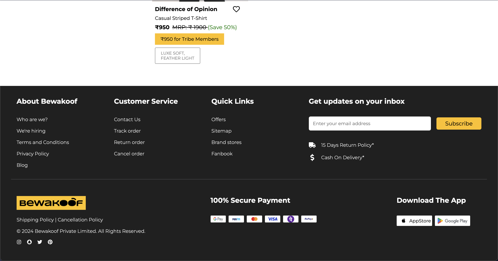
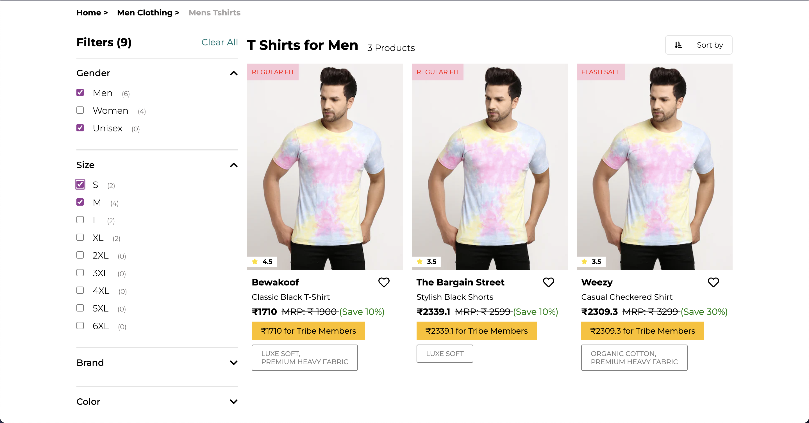
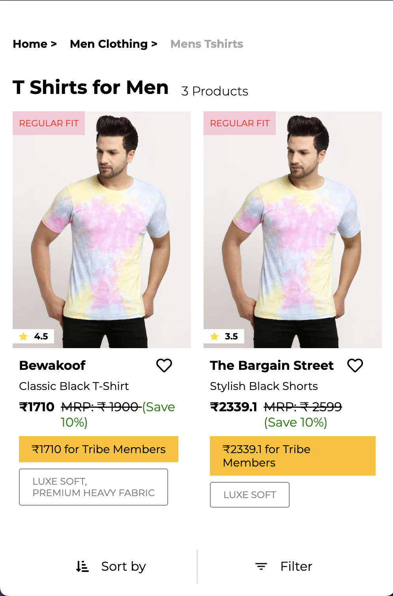

# Ecommerce Frontend

The frontend for a basic ecommerce site which includes searching, filtering, and sorting of products and has been made fully responsive.

## Features

1. Searches for products using a debounce function which registers key strokes after a 500ms delay, for optimization.
2. Filtering of products based on a number of filters, made possible with state management using React Context API.
3. Sorts products based on popularity and price.

## Screenshots

### Desktop

### Mobile

## To Run

1. Clone into repo
2. Run `npm install`
3. Run `npm run dev`

## Live Demo

https://ecommerce-tmrw.vercel.app/
